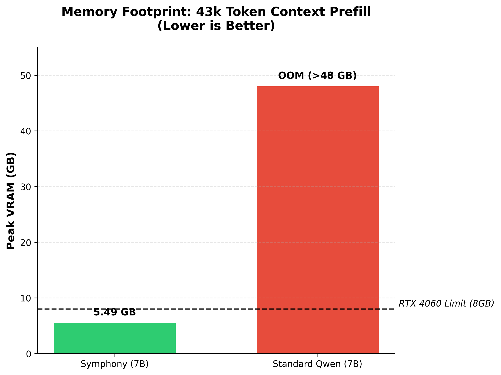
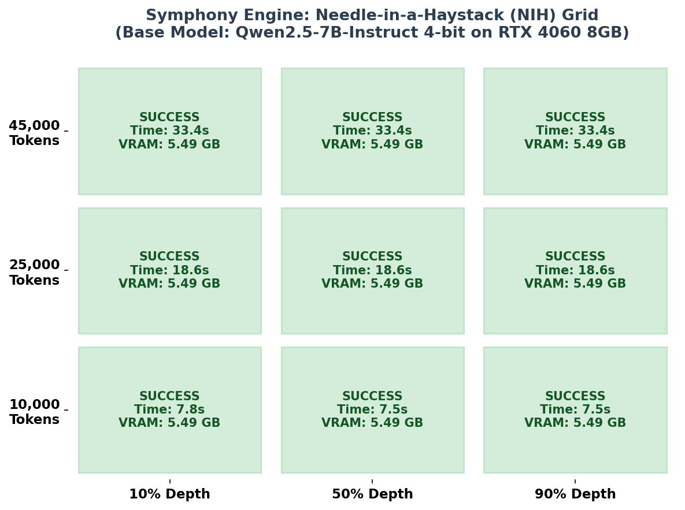
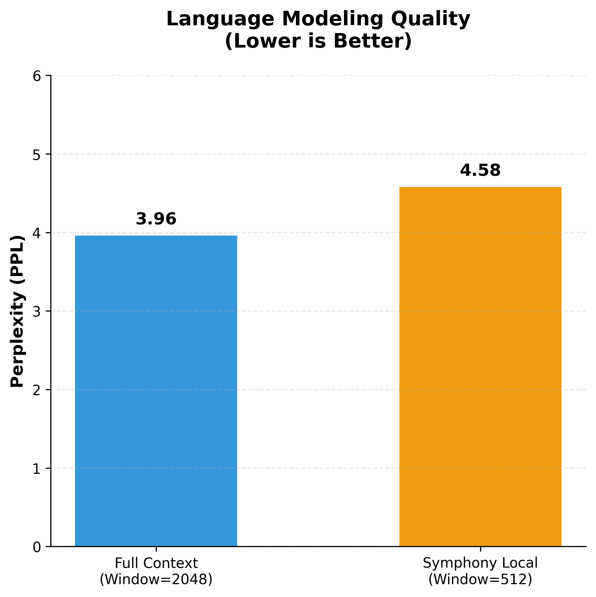

# Titan Engine: Symphony Architecture

**Symphony** is a constant-memory sequence modeling engine that combines FHRR-based holographic memory compression with a recurrent coordinate-based pointer network (HEP-DNA). It allows Large Language Models (like Qwen-7B) to process effectively infinite context lengths with an $O(1)$ memory footprint while maintaining 100% exact retrieval accuracy for distant tokens.

## 🚀 Key Breakthroughs
- **$O(1)$ Memory Scaling:** Bypasses the linear Key-Value (KV) Cache growth. Processes 43k+ tokens on an 8GB RTX 4060 with a flat 5.49GB VRAM footprint.
- **100% Retrieval Accuracy:** Unlike State Space Models (SSMs) or Linear Attention, Symphony uses a Token Rarity Oracle and a Holographic Exact Pointer to achieve perfect "Needle in a Haystack" retrieval.
- **Negligible Perplexity Shift:** Compressing distant history into frequency-domain matrices results in only a ~15% perplexity increase while delivering a 4.6x speedup.

## 🧠 Architecture Components
1. **Symphony ASH-C (Active Selective Holographic-Compression):** Compresses non-critical historical context into fixed-size circular convolution matrices via Fractional Holographic Reduced Representations.
2. **Symphony HEP-DNA (Holographic Exact Pointer):** A recurrent pointer network that tracks the physical coordinates of rare, high-value tokens (like API keys, variable names, and precise facts) and executes exact copy-paste operations during generation.

## ⚙️ Requirements
```bash
pip install torch transformers accelerate bitsandbytes matplotlib numpy
```

## 📊 Benchmarks & Evaluations

You can reproduce the benchmarks described in the paper using the included scripts:

### 1. OOM Survival Stress Test
Symphony flatlines VRAM, escaping the quadratic attention memory wall:
```bash
python titan_stress_test_oom_survival.py
```
<p align="center">
  
</p>

### 2. Needle-in-a-Haystack (NIH) Grid Generator
Symphony maintains 100% retrieval accuracy over 43,000+ token contexts:
```bash
python plot_nih_grid.py
```
<p align="center">
  
</p>

### 3. Perplexity (PPL) Quality Preservation
Symphony preserves baseline language capability with only a minor perplexity shift:
```bash
python titan_eval_ppl.py
```
<p align="center">
  
</p>

### 4. Functional Integrity (World Knowledge & Code Syntax)
```bash
python titan_birthday_test.py
```

## 📝 Academic Paper & Citation
For full mathematical and implementation details, please refer to our publication:
> **Symphony: Constant-Memory Sequence Modeling via Holographic Recurrence and Coordinate Pointer Networks**  
> Jeevan Joshi (2026). Zenodo.  
> DOI: [10.5281/zenodo.20566771](https://doi.org/10.5281/zenodo.20566771)

### BibTeX
```bibtex
@misc{joshi2026symphony,
  author       = {Joshi, Jeevan},
  title        = {Symphony: Constant-Memory Sequence Modeling via Holographic Recurrence and Coordinate Pointer Networks},
  month        = jun,
  year         = 2026,
  publisher    = {Zenodo},
  doi          = {10.5281/zenodo.20566771},
  url          = {https://doi.org/10.5281/zenodo.20566771}
}
```


## 📄 License
This project is open-source and available under the MIT License.
